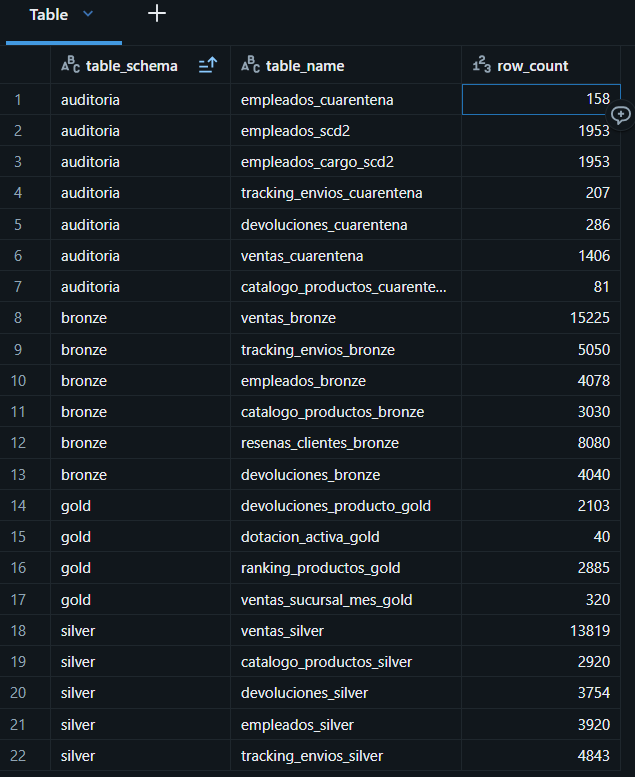
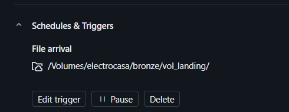
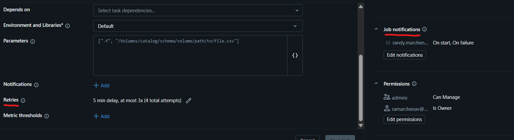
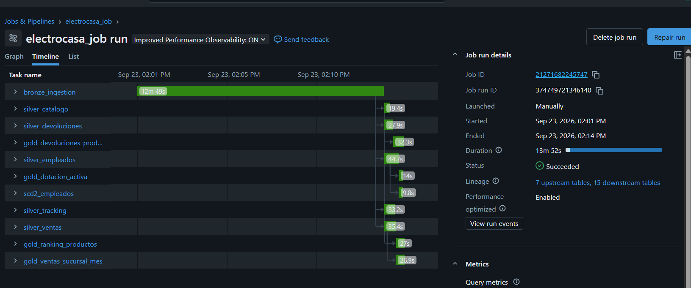
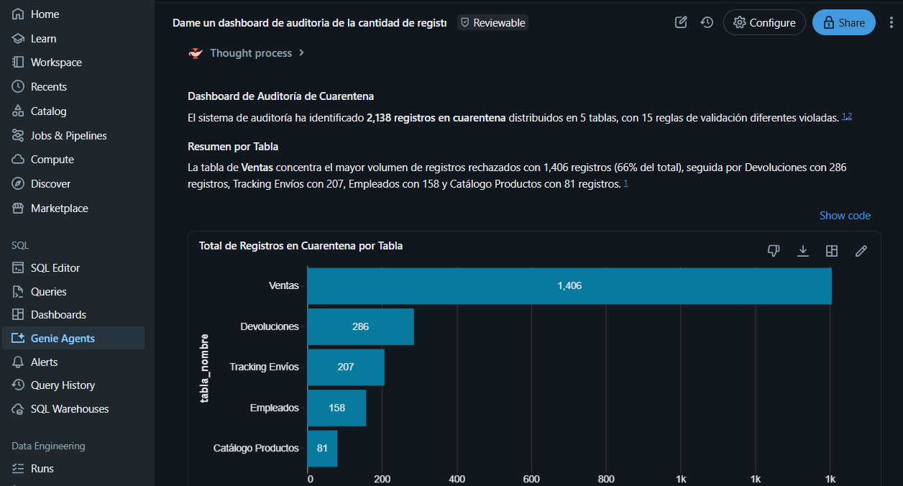
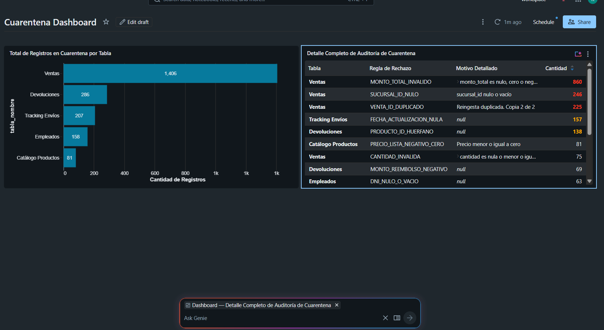
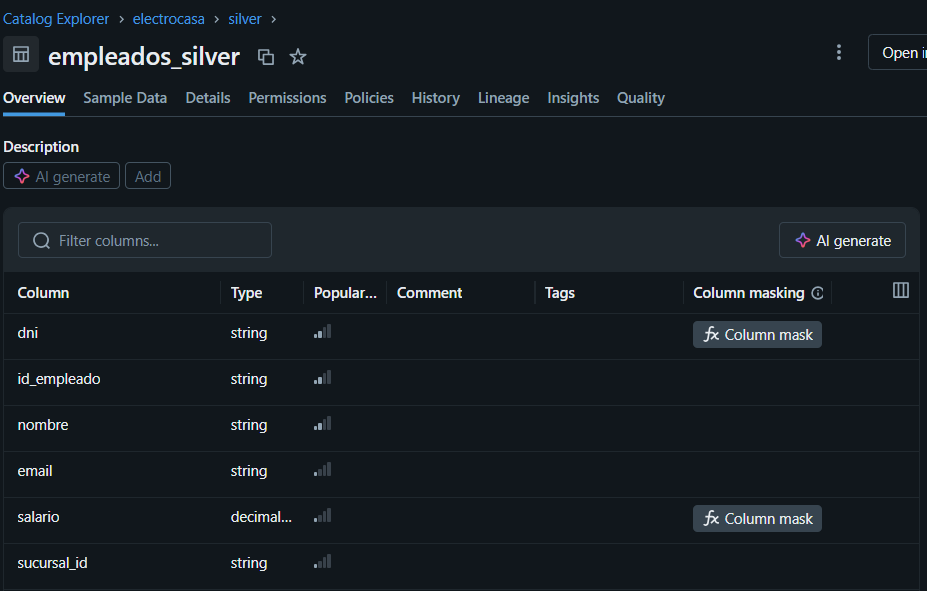
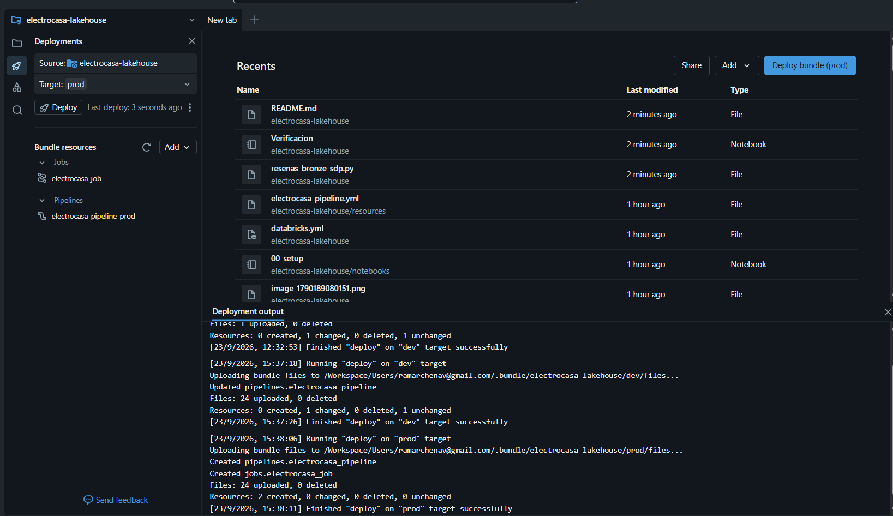
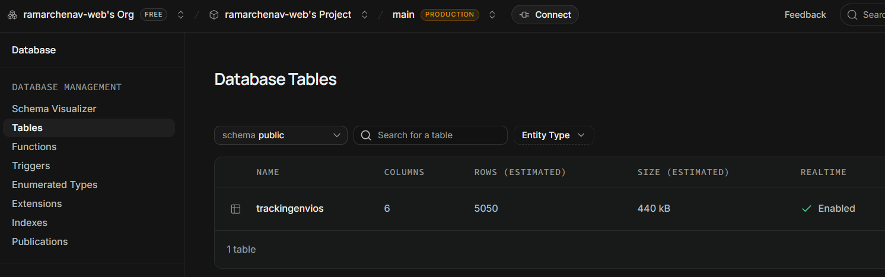

# Proyecto integrador - electrocasa-lakehouse
Autor: Randy Alexis Marchena Vilchez

## Introduccion

El proyecto fue elaborado en Databricks free edition, y dado ciertas restrcitiones se han cambiado la fuente de ingesta de tracking_envios usando SupaBase.com.

Por lo tanto se considera:  
**Tracking de envíos**: Conexión JDBC a Supabase PostgreSQL utilizando Secret Scope  

Para el uso de las credenciales se usaron secrets de usuario y password.

## Caso de Negocio

ElectroCasa es una cadena de electrodomésticos que opera múltiples sucursales. El objetivo de este proyecto es construir una plataforma de datos que permite responder preguntas de negocio como:

- ¿Cuánto vendió cada sucursal por mes?
- ¿Qué productos son los más vendidos?
- ¿Qué productos generan más devoluciones?
- ¿Cuál es la dotación activa por sucursal?
- ¿Cuál es el estado actual de los envíos?
## Arquitectura

Se implementó una arquitectura Medallion en Unity Catalog compuesta por:

- Bronze: ingestión raw desde CSV, JSON y PostgreSQL (Supabase).
- Silver: limpieza, normalización, deduplicación y validaciones de calidad.
- Gold: capa analítica orientada a responder preguntas de negocio.

Esquemas utilizados:

electrocasa.bronze
electrocasa.silver
electrocasa.gold
electrocasa.auditoria
## Estrategia de Ingesta

| Fuente | Método | Justificación |
|----------|----------|----------|
| Ventas | COPY INTO / Batch | Archivo CSV diario relativamente estable |
| Catálogo | Batch JSON | Snapshot de baja frecuencia |
| Empleados | Auto Loader | Eventos incrementales que pueden llegar periódicamente |
| Devoluciones | Auto Loader | Fuente incremental diaria |
| Reseñas | JSON batch | Datos semiestructurados |
| Tracking | JDBC PostgreSQL (Supabase) | Fuente externa transaccional consultada bajo demanda |
## Pipeline ejecutado

Se implementa una arquitectura Medallion compuesta por las capas Bronze, Silver y Gold. Adicionalmente se ha creado un esquema de Auditoria para control de calidad.

Evidencia de Pipeline ejecutado  

## Ejecución del Job

Se implementó un Lakeflow Job encargado de ejecutar el flujo completo de procesamiento de datos. El job inicia con la carga de datos en Bronze, continúa con las transformaciones de Silver y finaliza con la generación de las tablas analíticas Gold.

La ejecución se dispara automáticamente ante la llegada de nuevos archivos al Volume de landing.  

Cuenta con dependencias entre tareas, reintentos automáticos por task y notificaciones por correo en caso iniciar el job o por error del job completo.  

No se envia notificaciones por task para evitar caer en spam

La siguiente imagen muestra una ejecución exitosa del proceso de punta a punta. 

## Historizacion de datos empleados
Se implementó Slowly Changing Dimension Type 2 (SCD2)
para preservar el historial de cambios de los empleados.

Los cambios del cargo del empleado generan una nueva versión del registro,
manteniendo las versiones anteriores con:

- fecha_inicio
- fecha_fin
- es_actual
- version_scd

La tabla historizada se almacena en:
electrocasa.auditoria.empleados_cargo_scd2

SOLO se trabajó para el **cargo** de los empleados, dado que la fuente de datos procede de un StreamEvent o Sistema con eventos definidos en el caso de cambiar la sucursal o salario estos ya vienen en la fuente de origen de datos con los eventos "transferencia" y "cambio_salario" respectivamente.

## Calidad de Datos

Se implementaron reglas de validación en Silver.

Política utilizada: DESCARTE + CUARENTENA.

Los registros inválidos no son eliminados silenciosamente.
Todos son almacenados en tablas del esquema auditoria para trazabilidad y reproceso.

Ejemplos:

- monto_total > 0
- cantidad > 0
- dni no nulo
- salario > 0
- pedido_id obligatorio
- tracking_id no duplicado
- precio_lista > 0  

En el esquema de auditoria se colocaron las tablas de cuarentena y se ha usado Genie Agents para aprovechar estas tablas

Lo cual se puede generar un Dashboard de forma mas ágil

## Gobierno y Seguridad

Se crearon tres grupos:

- ingenieria
- analistas
- auditoria

Permisos:

- Ingenieria: lectura y escritura total.
- Analistas: solo lectura sobre Gold.
- Auditoria: acceso a Gold y Auditoria.

Datos sensibles protegidos:
- dni
- salario  

Estos datos no podran ser vistos si el usuario pertenece a un grupo diferente al de "ingenieria"  
Se implementaron funciones desde  
`src/electrocasa/transformations/masking_columns.py`

## Consideraciones de Costos

Se ha desarrollado en Databricks Free Edition, por lo que no fue posible utilizar recursos de cómputo dedicados como Job Clusters o Serverless Compute. Sin embargo, desde una perspectiva de diseño para un entorno productivo, se consideró la siguiente estrategia:

- Lakeflow Pipeline (Bronze, Silver y Gold):
  Se utilizaría Serverless Compute debido a que las cargas son mayoritariamente batch e incrementales, permitiendo escalar automáticamente según la demanda y reduciendo la administración de infraestructura.

- Ingesta mediante Auto Loader (Empleados y Devoluciones):
  Se utilizaría Serverless Compute por tratarse de procesos disparados por llegada de nuevos archivos, donde el consumo se ajusta dinámicamente al volumen procesado.

- Ingesta JDBC de Tracking de Envíos:
  Se utilizaría Serverless Compute debido al bajo volumen de datos y a la necesidad de consultas ocasionales bajo demanda, evitando mantener recursos dedicados activos.

Esta estrategia busca minimizar costos operativos manteniendo la capacidad de escalar automáticamente ante incrementos de volumen y evitando recursos ociosos cuando no existen ejecuciones activas.  

##Despliegue  
Se configuraron dos ambientes:  
dev: ambiente de desarrollo y pruebas.
prod: ambiente productivo.
**Despliegue en DEV**  
Resultado:  
Target: dev  
Pipeline desplegado: electrocasa-pipeline-dev  
Job desplegado: electrocasa_job  
Estado: Finished "deploy" on "dev" target successfully  

**Despliegue en PROD**  
Resultado:  
Target: prod  
Pipeline desplegado: electrocasa-pipeline-prod  
Job desplegado: electrocasa_job  
Estado: Finished "deploy" on "prod" target successfully  

___
## Otras observaciones
### Sobre 00_setup  
**Catalogo y Esquemas**  
Para la creacion de los esquemas y del catalogo se crearan de forma automatica con el codigo indicado en caso de no existir con:  
`CREATE <Elemento> IF NOT EXISTS`  

**Grupos y Privilegios**  
Se deben tener creados los siguientes
- ingenieria
- analistas
- auditoria  

Debido al uso de Databricks Free Edition,
los grupos deben crearse manualmente asegurandonos que
esten sincronizados con nuestra cuenta
Para verificar los grupos, correr en un notebook lo siguiente:  
`%sql`  
`SHOW GROUPS;`

**Advertencia**  
Si se utiliza codigo en la creacion de los grupos,
estos no pueden ser creados a nivel 
workspace dado que no es compatible con Unity Catalog.  
En un entorno productivo los grupos deberían
ser account-level groups gestionados mediante
Unity Catalog.  

Para verificar que los permisos se concedireron adecuadamente, usar siguiente:  
`%sql`  
`SHOW GRANTS ON SCHEMA electrocasa.<Esquema>;`  
<!-- `SHOW GRANTS ON VOLUME electrocasa.bronze.vol_landing;`   -->
En caso de necesitar eliminar toda la configuracion, usar el siguiente codigo  
`%sql`  
`DROP CATALOG electrocasa CASCADE;`   

#### Sobre la Ingesta de Supabase
Se creo el secret scope y los secrets seguir los pasos descritos:
https://docs.databricks.com/aws/en/security/secrets/?language=Databricks%C2%A0SDK%C2%A0for%C2%A0Python 
Por medio de la plataforma de DMC al momento de entregar la evaluación en los comentarios se han proporcionado las credenciales necesarias para los dos secrets.  
Con las cuales se creo la conneción como PostgreSQL

